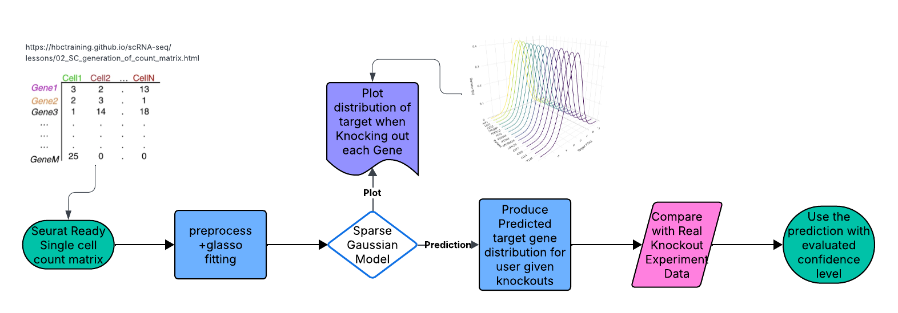

# GetNC

## Description

**GetNC** (*Gaussian Experiment Testing and Knockout Calculator*) is an R package for modeling and validating **gene regulatory relationships** using multivariate Gaussian inference. It fits sparse Gaussian graphical models from single-cell expression data, predicts **combinational knockout outcomes** via closed-form conditional Gaussian formulas, and validates model reliability against observed perturbation experiments.

**Key innovation:**
GetNC bridges the gap between network inference and biological validation — providing a **mathematically interpretable**, simulation-free method to predict and assess perturbation effects directly from fitted graphical models.

Developed under **R version 4.5.2 (2023-10-31)** on **macOS 12.5**.

---

## Installation

To install the latest version of the package:

```r
install.packages("devtools")
library("devtools")
devtools::install_github("ZhanyanGuo/getNC", build_vignettes = TRUE)
library("getNC")
```

To run the Shiny app: *Under construction.*

---

## Overview

### Quick start

```r
ls("package:getNC")
data(package = "getNC")
browseVignettes("getNC")
```

### Core user functions

| Function                                 | Purpose                                                                                |
| ---------------------------------------- | -------------------------------------------------------------------------------------- |
| `fit_glasso()`                           | Fit sparse Gaussian graphical model from gene expression data (using graphical lasso). |
| `predict_conditional_knockout()`         | Compute conditional mean and variance for a target gene given knockout set.            |
| `predict_knockout_from_fit()`            | Wrapper for conditional prediction using a fitted `fit_glasso()` object.               |
| `plot_partner_knockout_densities_dual()` | Generate 3D Gaussian density plots for top-K mean/variance partners.                   |
| `validate_knockout_group_from_fit()`     | Statistical validation of model predictions using observed knockout replicates.        |

### Workflow diagram



**Input:** single-cell RNA-seq matrix ready for Seurat Read10x(e.g., the output of the cellranger pipeline from 10X, returning a unique molecular identified (UMI) count matrix). See seurat.
**Output:** Prediction of expression distribution of a target gene for user chosen knockouts and validation summary provided experimental knockout results.

For a step-by-step walkthrough:

```r
browseVignettes("getNC")
```

---

## Contributions

**Author:** Zhanyan Guo

* Designed core statistical framework for conditional Gaussian modeling of combinational knockouts.
* Implemented covariance recovery, conditional prediction, and validation workflow.
* Authored vignette and documentation.

**External packages used**

| Package      | Role                                                          | Reference                                                                                                                                       |
| ------------ | ------------------------------------------------------------- | ----------------------------------------------------------------------------------------------------------------------------------------------- |
| **Seurat**   | Normalization, variable feature selection, scaling            | Hao, Y. et al. (2021). *Integrated analysis of multimodal single-cell data*. Cell 184(13):3573–3587.                                            |
| **glasso**   | Graphical lasso estimation for sparse inverse covariance      | Friedman, J., Hastie, T., & Tibshirani, R. (2008). *Sparse inverse covariance estimation with the graphical lasso*. Biostatistics 9(3):432–441. |
| **plotly**   | 3D visualization of conditional densities                     | Sievert, C. (2020). *Interactive Web-Based Data Visualization with R, plotly, and shiny.* CRC Press.                                            |
| **stats**    | Multivariate normal conditioning and base statistical methods | R Core Team (2024). *R: A Language and Environment for Statistical Computing.*                                                                  |
| **Matrix**   | Efficient linear algebra and sparse matrix support            | Bates, D., Maechler, M., & Jagan, M. (2023). *Matrix: Sparse and Dense Matrix Classes and Methods*. CRAN.                                       |
| **testthat** | Automated testing framework                                   | Wickham, H. (2011). *testthat: Get Started with Testing.* The R Journal 3(1):5–10.                                                              |
| **usethis**  | Package development utilities                                 | Wickham, H., & Bryan, J. (2023). *usethis: Automate Package and Project Setup.* CRAN.                                                           |
| **devtools** | Installation and build tools for R packages                   | Wickham, H., & Chang, W. (2023). *devtools: Tools to Make Developing R Packages Easier.* CRAN.                                                  |

**Generative AI assistance**

* ChatGPT (OpenAI GPT-5) was used for:

  * drafting documentation templates,
  * optimizing code clarity and roxygen comments,
  * generating part of the test and vignette narrative.

---

## References

* Friedman, J., Hastie, T., & Tibshirani, R. (2008). *Sparse inverse covariance estimation with the graphical lasso.* Biostatistics, 9(3):432–441.
* Hao, Y. et al. (2021). *Integrated analysis of multimodal single-cell data.* *Cell*, 184(13), 3573–3587.
* C. Sievert (2020). *Interactive Web-Based Data Visualization with R, plotly, and shiny.* CRC Press.
* Bates, D., Maechler, M., & Jagan, M. (2023). *Matrix: Sparse and Dense Matrix Classes and Methods.* CRAN.
* Wickham, H. (2011). *testthat: Get Started with Testing.* *The R Journal*, 3(1), 5–10.
* Wickham, H., & Bryan, J. (2023). *usethis: Automate Package and Project Setup.* CRAN.
* Wickham, H., & Chang, W. (2023). *devtools: Tools to Make Developing R Packages Easier.* CRAN.
* R Core Team (2024). *R: A Language and Environment for Statistical Computing.* Vienna, Austria.

---

## Acknowledgements

This package was developed as part of an assessment for the **2025 BCB410H: Applied Bioinformatics** course
at the **University of Toronto, Toronto, CANADA**.

**GetNC** welcomes issues, enhancement requests, and contributions.
To submit an issue, please use the **GitHub Issues** page.

---

```r
sessionInfo()
```

R version 4.5.2 (2025-10-31)
Platform: aarch64-apple-darwin20
Running under: macOS Monterey 12.5

Matrix products: default
BLAS:   /System/Library/Frameworks/Accelerate.framework/Versions/A/Frameworks/vecLib.framework/Versions/A/libBLAS.dylib 
LAPACK: /Library/Frameworks/R.framework/Versions/4.5-arm64/Resources/lib/libRlapack.dylib;  LAPACK version 3.12.1

locale:
[1] en_US.UTF-8/en_US.UTF-8/en_US.UTF-8/C/en_US.UTF-8/en_US.UTF-8

time zone: America/Toronto
tzcode source: internal

attached base packages:
[1] stats     graphics  grDevices utils     datasets  methods   base     

other attached packages:
[1] getNC_0.0.0.9000 testthat_3.2.3  

loaded via a namespace (and not attached):
  [1] RColorBrewer_1.1-3     sys_3.4.3              rstudioapi_0.17.1     
  [4] jsonlite_2.0.0         magrittr_2.0.4         spatstat.utils_3.2-0  
  [7] rmarkdown_2.29         farver_2.1.2           fs_1.6.6              
 [10] vctrs_0.6.5            ROCR_1.0-11            memoise_2.0.1         
 [13] spatstat.explore_3.5-3 askpass_1.2.1          gh_1.5.0              
 [16] htmltools_0.5.8.1      usethis_3.2.1          curl_7.0.0            
 [19] sctransform_0.4.2      parallelly_1.45.1      KernSmooth_2.23-26    
 [22] htmlwidgets_1.6.4      desc_1.4.3             ica_1.0-3             
 [25] httr2_1.2.1            plyr_1.8.9             plotly_4.11.0         
 [28] zoo_1.8-14             cachem_1.1.0           commonmark_2.0.0      
 [31] whisker_0.4.1          igraph_2.2.1           mime_0.13             
 [34] lifecycle_1.0.4        pkgconfig_2.0.3        Matrix_1.7-4          
 [37] R6_2.6.1               fastmap_1.2.0          fitdistrplus_1.2-4    
 [40] future_1.67.0          shiny_1.11.1           digest_0.6.37         
 [43] patchwork_1.3.2        ps_1.9.1               rprojroot_2.1.1       
 [46] Seurat_5.3.1           tensor_1.5.1           RSpectra_0.16-2       
 [49] irlba_2.3.5.1          pkgload_1.4.1          crosstalk_1.2.2       
 [52] progressr_0.17.0       spatstat.sparse_3.1-0  httr_1.4.7            
 [55] polyclip_1.10-7        abind_1.4-8            compiler_4.5.2        
 [58] remotes_2.5.0          withr_3.0.2            glasso_1.11           
 [61] S7_0.2.0               fastDummies_1.7.5      pkgbuild_1.4.8        
 [64] MASS_7.3-65            openssl_2.3.3          rappdirs_0.3.3        
 [67] sessioninfo_1.2.3      tools_4.5.2            lmtest_0.9-40         
 [70] httpuv_1.6.16          future.apply_1.20.0    goftest_1.2-3         
 [73] glue_1.8.0             callr_3.7.6            nlme_3.1-168          
 [76] promises_1.3.3         grid_4.5.2             Rtsne_0.17            
 [79] cluster_2.1.8.1        reshape2_1.4.4         generics_0.1.4        
 [82] diffobj_0.3.6          gtable_0.3.6           spatstat.data_3.1-9   
 [85] tidyr_1.3.1            data.table_1.17.8      xml2_1.4.0            
 [88] sp_2.2-0               spatstat.geom_3.6-0    RcppAnnoy_0.0.22      
 [91] ggrepel_0.9.6          RANN_2.6.2             pillar_1.11.1         
 [94] stringr_1.5.2          spam_2.11-1            RcppHNSW_0.6.0        
 [97] later_1.4.4            splines_4.5.2          dplyr_1.1.4           
[100] lattice_0.22-7         survival_3.8-3         deldir_2.0-4          
[103] tidyselect_1.2.1       miniUI_0.1.2           pbapply_1.7-4         
[106] knitr_1.50             gitcreds_0.1.2         gridExtra_2.3         
[109] scattermore_1.2        xfun_0.53              credentials_2.0.3     
[112] devtools_2.4.6         brio_1.1.5             matrixStats_1.5.0     
[115] stringi_1.8.7          lazyeval_0.2.2         evaluate_1.0.5        
[118] codetools_0.2-20       tibble_3.3.0           cli_3.6.5             
[121] uwot_0.2.3             xtable_1.8-4           reticulate_1.44.0     
[124] roxygen2_7.3.3         processx_3.8.6         gert_2.1.5            
[127] Rcpp_1.1.0             globals_0.18.0         spatstat.random_3.4-2 
[130] png_0.1-8              spatstat.univar_3.1-4  parallel_4.5.2        
[133] ellipsis_0.3.2         ggplot2_4.0.0          dotCall64_1.2         
[136] listenv_0.10.0         viridisLite_0.4.2      scales_1.4.0          
[139] ggridges_0.5.7         crayon_1.5.3           SeuratObject_5.2.0    
[142] purrr_1.1.0            rlang_1.1.6            cowplot_1.2.0         
[145] waldo_0.6.2           
> 