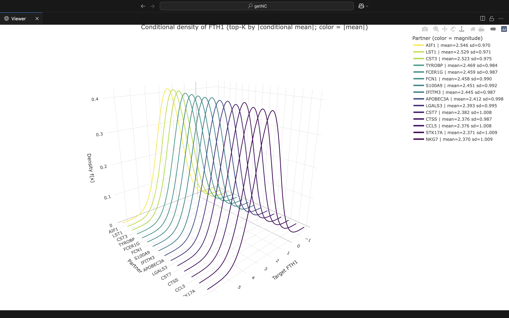

```{r, include = FALSE}
knitr::opts_chunk$set(
  collapse = TRUE,
  comment = "#>"
)
```

```{r setup}
library(getNC)
```
# Purpose

This vignette shows how to use **GetNC** to:

- fit a Gaussian graphical model on single-cell expression,
- predict combinational knockout results using closed-form conditioning, and
- when we have matched perturbation data, validate whether the Gaussian modeling is reliable.

We keep the language simple and use a small example so the steps are clear.

---

# Load package

We recommend also having **Seurat**, **SeuratObject**, **glasso**, and **plotly** installed.

```{r}
suppressPackageStartupMessages({
  library(getNC)
})
```

---

# Step 0 — Fit glasso on example data

If `obj = NULL`, `fit_glasso()` uses a small dataset bundled with the package.  
We keep `nfeatures` modest so it runs fast.

```{r}
fit <- fit_glasso(
  obj = NULL,      # use package example (e.g., pbmc_small)
  nfeatures = 100,
  rho = 0.2
)

# check the dimentions of fit if needed
cat(sprintf("features: %d\n", length(fit$features)))
cat(sprintf("omega dim: %d x %d\n", nrow(fit$omega), ncol(fit$omega)))
cat(sprintf("sigma dim: %d x %d\n", nrow(fit$sigma), ncol(fit$sigma)))
```

---

# Step 1 — Conditional prediction for a combinational knockout

We select one target gene and a set of knocked genes, and compute
\( \mathbb{E}[\text{target}\mid \text{knocked}=0] \) and its conditional variance
from the fitted Gaussian model.

```{r}
genes   <- fit$features
target  <- genes[5]
knocked <- genes[c(3, 7, 9)]

res <- predict_knockout_from_fit(
  fit,
  target = target,
  knocked = knocked
)

mu_c  <- as.numeric(res$mean_cond[1])
var_c <- as.numeric(res$cov_cond[1, 1])

# print the needed results
cat(sprintf("target: %s\n", target))
cat(sprintf("knocked: %s\n", paste(knocked, collapse = ", ")))
cat(sprintf("E[target | knocked=0] = %.4f\n", mu_c))
cat(sprintf("Var[target | knocked=0] = %.4f\n", var_c))
```

---

# Step 2 — Visualize partner knockouts (3D density)

We look at partner genes. For each partner \(g\), we predict the target distribution
under \(\{\text{knocked} \cup g\}\).  
We show two plots: top-K partners by conditional **mean** and by conditional **variance**.

```{r}
plots <- plot_partner_knockout_densities_dual(
  fit,
  target = target,
  knocked = knocked,
  k = 15,
  use_original_units = TRUE
)

# To view Plots use
# plots$mean_plot
# plots$var_plot


```
---

# Step 3 — Validate with synthetic knockout measurements

Now we simulate measurements for this same target and knockout set from the conditional
Normal we just computed. We then do two group tests:

- a **t-test** on the mean (decoupled from model variance), and  
- a **chi-square** test on variance.

```{r}
sd_c <- sqrt(max(var_c, 0))
set.seed(42)
y_obs <- rnorm(40, mean = mu_c, sd = sd_c)

val <- validate_knockout_group_from_fit(
  fit,
  target  = target,
  knocked = knocked,
  y = y_obs,
  use_original_units = TRUE
)

# To see the P value for each test
cat("Validation results:\n")
cat(sprintf("  p_mean (mean, t)   = %.4g\n", val$p_mean))
cat(sprintf("  p_chisq (variance)  = %.4g\n", val$p_chisq))
cat(sprintf("  n (replicates)      = %d\n", val$n))
```

**Reading the p-values.**

- If we simulate from the model, p-values vary (roughly uniform).
- A small `p_mean` suggests the **mean** is off.
- A small `p_chisq` suggests the **variance** is off.

You can try changing the data to see sensitivity

---

# Notes on the model

- We fit glasso on **variance-normalized** features (z-scores).
  We keep per-gene SD so we can recover covariances in original units if needed.
- We use closed-form multivariate Normal **conditioning** to predict combinational knockouts.
- When real perturbation data exist for the same target and knockout set,
  we can **validate** the Gaussian assumption directly with the tests above.

---

# Gaussian formulas (conditioning and marginalizing)

Let \(X \sim \mathcal{N}(\mu, \Sigma)\) be partitioned as
\( X = \begin{bmatrix} X_a \\ X_b \end{bmatrix} \)
with mean
\( \mu = \begin{bmatrix} \mu_a \\ \mu_b \end{bmatrix} \)
and covariance
\[
\Sigma =
\begin{bmatrix}
\Sigma_{aa} & \Sigma_{ab} \\
\Sigma_{ba} & \Sigma_{bb}
\end{bmatrix}.
\]

Conditioning on \(X_b = x_b\):
\[
X_a \mid X_b = x_b \;\sim\; \mathcal{N}\!\left(\mu_{a\mid b},\, \Sigma_{a\mid b}\right),
\quad
\mu_{a\mid b}
= \mu_a + \Sigma_{ab}\,\Sigma_{bb}^{-1}\,(x_b - \mu_b),
\quad
\Sigma_{a\mid b}
= \Sigma_{aa} - \Sigma_{ab}\,\Sigma_{bb}^{-1}\,\Sigma_{ba}.
\]

In our knockout setting we take \(x_b = 0\).

Marginalizing (taking only a subset) just selects the corresponding block of \(\mu\) and \(\Sigma\).
For example, the marginal of \(X_a\) is \(\mathcal{N}(\mu_a, \Sigma_{aa})\).

---

# Generative AI usage
This vignette is built partly with Chat-gpt 5 for term correction and formalization.

---

# Session info

```{r}
sessionInfo()
```
